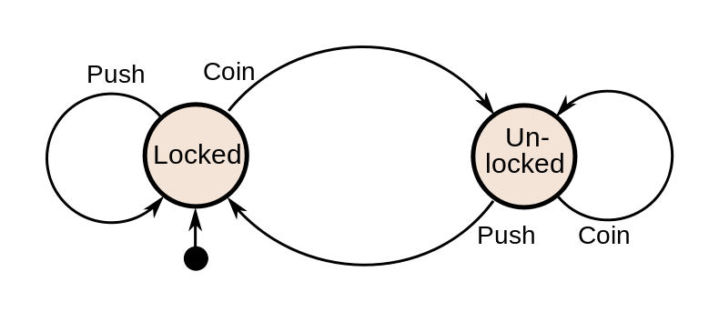

Enum and Workflows
==================


Enum
----
Enum is a set of named values called elements, members or enumerators of the type.

```
public enum weekDayType
{
    suday,
    monday,
    tuesday,
    wendsday,
    thursday,
    friday,
    saturday
};

public enum 10TypesOfPeople
{
    thoseWhoUnderstandTheBinary,
    thoseWhoDoNot
};

```

Workflow
--------

You can implement a state machine by using enum to make your workflow in Nany.
In this case, an enum is like a class with its methods and members to allow/prohibit to go to another stat.

Here is a state machine of Turnstile:


It can be written in Nany:
```
enum Turnstile
{
	locked,
	unlocked
	
	on locked -> unlocked do
	{
		if coin then
		{
			coin = false; // No error - go to unlocked state
		}
		else if push then
		{
			raise new std.error.Fail; // raise the error - stay in locked state
		}	
	}
	
	on unlocked -> locked do
	{
		if push then
		{
			push = false; // No error - go to locked state
		}
		else if coin then
		{
			raise new std.error.Fail; // raise the error - stay in unlocked state
		}
	}
	
	var push = false;
	var coin = false;
}

```